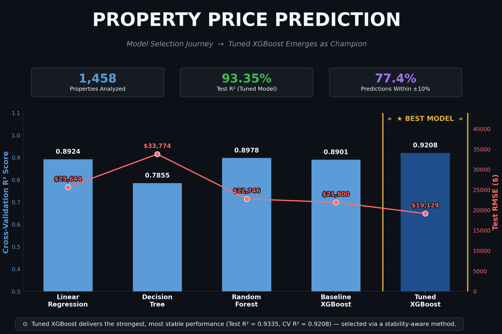

# 🏡 PROPERTY PRICE PREDICTION


---

<p align="center">
  
</p>

---

> **📄 For full analytical detail:**
> Complete methodology, EDA findings, and business insights are documented in the accompanying
> [Property_Price_Prediction_Report](./Property_Price_Prediction_Report.docx). This README provides
> a high-level project summary — the report contains the complete write-up.

---

### **Predicting Property Prices in a Specific Location Using Machine Learning**

An end-to-end machine learning project that predicts residential property sale prices from structural, quality, and location characteristics, while identifying the factors that most strongly drive that price. The project combines rigorous data cleaning, exploratory analysis, empirical dimensionality-reduction testing, model comparison, hyperparameter tuning, and business interpretation into a single reproducible Colab workflow.

Rather than treating prediction as the end goal, this notebook focuses on understanding **why** prices vary across properties — testing assumptions empirically (including whether PCA actually helps) rather than accepting them on convention — and translating those findings into actionable pricing insight.

---

<p align="center"><i>End-to-end machine learning workflow for property price prediction, from raw data through to a tuned, validated pricing model.</i></p>

---

## 📌 Project Overview

Real estate prices are shaped by a wide mix of interacting factors — structural quality, size, location, and condition all contribute differently, making manual valuation inconsistent and difficult to scale. This project develops a complete pipeline capable of estimating property prices directly from their characteristics, while identifying which features genuinely influence market value.

Starting from a raw property dataset, the notebook performs:

- Domain-informed data cleaning and missing-value treatment
- Feature engineering (derived size, age, and bathroom metrics)
- Exploratory Data Analysis (univariate, bivariate, multivariate)
- Ordinal and nominal categorical encoding
- Feature scaling and empirical PCA evaluation
- Machine learning model comparison across two feature sets
- Hyperparameter optimization with result caching
- Feature importance and prediction error analysis
- Final retraining and sample price predictions

The analysis is driven by one central question:

> **Which property characteristics drive residential sale prices, and can machine learning accurately predict prices from those characteristics alone?**

Every analytical decision — from outlier treatment method to PCA's actual usefulness — is validated empirically rather than assumed, so each conclusion is backed by measurable evidence rather than convention.

---

## 🎯 Project Objectives

This project aims to:

- Collect and clean a real-world property dataset without dropping columns other than the ID field.
- Correctly distinguish and handle ordinal versus nominal categorical variables using the metadata provided.
- Apply appropriate `fillna()`, scaling, and PCA techniques to handle missing data and evaluate their effect on model accuracy.
- Perform exploratory data analysis to identify the key variables influencing property price.
- Select and apply the correct encoding technique for each categorical variable based on its nature.
- Develop and compare multiple machine learning models for price prediction.
- Evaluate model performance against a defined R² benchmark and select the strongest, most stable model.
- Present findings and business insights clearly, supported by a written report.

---

## ❓ Key Business Questions

The notebook investigates the following questions:

1. Which property characteristics have the greatest impact on sale price?
2. Do ordinal and nominal categorical variables need to be encoded differently, and does it matter?
3. Does PCA-based dimensionality reduction actually improve model performance on this dataset?
4. Which regression algorithm best captures property pricing behaviour?
5. Which structural or quality features contribute most to predictive performance?
6. How reliable are the model's predictions, and where does it perform weakest?
7. How can these findings support pricing decisions, renovation prioritization, or valuation review?

---

## 🚀 Analytical Workflow

The notebook follows an end-to-end pipeline of 19 sections, each building on the last, transforming raw property records into an interpretable, tuned machine learning solution.

| Section | Purpose |
|---|---|
| **0a–0b. Setup** | Project introduction, objectives, library imports, and global visualization/theme configuration. |
| **01. Data Loading & Inspection** | Load the dataset via a Local → Google Drive → GitHub fallback cascade; inspect structure and data quality. |
| **02. Data Cleaning** | Correct mistyped data types, audit and treat missing values by genuine cause (absence vs. true gap), and validate the result. |
| **03. Feature Engineering** | Rename mislabeled columns, derive `HouseAge`, `YearsSinceRemodel`, `TotalSF`, `TotalBath`, and `TotalPorchSF`, and resolve a known dataset anomaly. |
| **04. Exploratory Data Analysis** | Univariate, bivariate, and multivariate analysis, including outlier detection (IQR + Z-Score) and 99th-percentile capping. |
| **05. Encoding** | Classify and encode 45 categorical columns — Ordinal Encoding for ranked scales, One-Hot Encoding (mode-dropped baseline) for unranked categories. |
| **06. Feature Scaling** | Standardize all 228 encoded features to mean 0, standard deviation 1. |
| **07. Model Building & Comparison (Original Features)** | Train and compare Linear Regression, Decision Tree, Random Forest, and XGBoost. |
| **08. Principal Component Analysis** | Evaluate explained variance and reduce to 126 components (90% variance retained). |
| **09. Model Building & Comparison (PCA Features)** | Re-train and compare the same four models on the PCA-transformed feature set. |
| **10. Best Model Selection** | Compare all 8 model/feature-set combinations using a stability-aware selection method. |
| **11. Hyperparameter Tuning & Evaluation** | Tune the selected model via GridSearchCV (with a parameter-caching cascade for fast re-runs) and evaluate the result. |
| **12. Feature Importance Analysis** | Interpret the tuned model using built-in XGBoost feature importance. |
| **13. Prediction Error Analysis** | Examine actual-vs-predicted alignment, residual behaviour, and percentage-error distribution. |
| **14. Final Model Retraining** | Retrain the tuned model on the complete dataset ahead of real-world prediction use. |
| **15. Sample Property Price Prediction** | Generate predictions for five representative property profiles spanning the full price range. |

The workflow intentionally follows the complete lifecycle of an applied machine learning project — from raw data to an explainable, validated pricing model.

---

## 📂 Dataset Overview

| Property | Detail |
|---|---|
| **Dataset** | `Property_data.csv` (Ames Housing dataset, renamed columns) |
| **Records** | 1,460 raw → 1,458 after anomaly removal |
| **Original Features** | 80 (plus `PropertyID`) |
| **Target Variable** | `PropPrice` (USD) |
| **Prediction Type** | Supervised Regression |

The dataset spans structural attributes, quality/condition ratings, and sale-specific details for residential properties. Several categorical columns required correcting a mislabeled "Basement" prefix that actually described garage attributes, and two properties were removed after being identified as a documented dataset anomaly — new-construction homes sold under a "Partial" sale condition before completion, which distorted the relationship between living area and price.

---

### Engineered Features

| Feature | Description |
|---|---|
| `HouseAge` | Years between construction and sale |
| `YearsSinceRemodel` | Years since the property's last remodel |
| `TotalSF` | Combined basement + first floor + second floor square footage |
| `TotalBath` | Weighted total bathroom count (full + 0.5 × half baths, basement and above-grade) |
| `TotalPorchSF` | Combined area across all porch/deck types |

---

## 🧹 Data Preprocessing

The preprocessing pipeline transforms the raw property records into a modelling-ready dataset.

Major preprocessing tasks include:

- Duplicate row detection and data type correction (coded categorical columns stored as numeric were converted to string)
- Missing value treatment grouped by genuine cause: absent-feature categoricals filled with `'None'`, absent-feature numerics filled with `0` or a sensible fallback, and genuinely missing values filled via neighborhood median or overall mode
- Outlier detection using both IQR and Z-Score methods for cross-validation, with 99th-percentile capping applied as the treatment method — chosen after IQR bounds produced impossible negative lower bounds on several area-based columns
- A documented anomaly review (`GrLivArea` vs. price) leading to targeted row removal rather than blanket capping

**Output:** Clean, structurally consistent dataset prepared for exploratory analysis and encoding.

---

## 📊 Exploratory Data Analysis

EDA is organised into four complementary stages.

#### 🔹 Univariate Analysis
- Categorical feature distributions (quality ratings, structure type, sale context)
- Numerical feature distributions with skew/kurtosis diagnostics
- Outlier analysis (box plots, IQR and Z-Score comparison)

#### 🔹 Bivariate Analysis
- Numerical features vs. price (living area, lot size, garage, porch, veneer)
- Time-based features vs. average price (property age, years since remodel)
- Ordinal and discrete features vs. price (overall quality, condition, bathroom count)
- Key categorical features vs. average price
- Neighborhood vs. average price

#### 🔹 Multivariate Analysis
- Correlation heatmap across key numerical and engineered features

**Output:** Dataset and feature relationships fully characterised ahead of encoding and modelling.

---

## 🔐 Encoding

Every categorical column was individually classified before encoding — not defaulted to a single method:

- **21 Ordinal columns** (genuine rank, e.g. quality scales from Poor to Excellent) were mapped to integers following their real order.
- **24 Nominal columns** (no inherent order, e.g. neighborhood, building type) were One-Hot Encoded, with each column's most frequent (mode) category dropped as an interpretable baseline — avoiding both the dummy variable trap and an arbitrary alphabetical reference point.

**Output:** 228 fully numeric, model-ready features (expanded from 86 pre-encoding).

---

## 🧮 Principal Component Analysis

Rather than assuming PCA would help, its actual effect was tested empirically across every model:

- 126 components were retained (90% of total variance) after evaluating the full explained-variance curve.
- All four models were re-trained on the PCA-transformed feature set and directly compared against their original-feature counterparts.
- **Result: PCA did not improve performance for any model.** Linear Regression was affected most severely, with cross-validation R² dropping sharply and unpredictably (0.8924 → 0.5775) — a clear instability signal that led to its exclusion from final model consideration.

---

## 🏁 Model Building & Comparison

Four regression algorithms were trained and evaluated under identical conditions, on **both** the original and PCA-transformed feature sets — eight combinations in total.

| Model | Type | Purpose |
|---|---|---|
| **Linear Regression** | Linear Baseline | Establish a benchmark for linear relationships |
| **Decision Tree Regressor** | Tree-Based | Capture non-linear decision boundaries |
| **Random Forest Regressor** | Bagging Ensemble | Improve prediction stability through ensemble learning |
| **XGBoost Regressor** | Boosting Ensemble | Sequentially minimise prediction errors |

### Model Comparison — Original Features

| Model | MAE | RMSE | Test R² | CV R² |
|---|---:|---:|---:|---:|
| Linear Regression | $18,000 | $25,644 | 0.8804 | 0.8924 |
| Decision Tree | $23,073 | $33,774 | 0.7926 | 0.7855 |
| Random Forest | $16,046 | $22,746 | 0.9059 | 0.8978 |
| XGBoost | $15,542 | $21,900 | 0.9128 | 0.8901 |

### Best Model Selection

The overall best model was chosen using a **stability filter** — excluding any model/feature-set combination with a Test R²–CV R² gap exceeding 0.05 — rather than picking the single highest Test R² in isolation. This directly prevented Linear Regression (PCA)'s unstable result from being mistakenly selected. **XGBoost (Original Features)** was selected as the strongest stable performer.

---

## ⚙️ Hyperparameter Optimization

The selected XGBoost model underwent systematic tuning:

- An initial narrow grid produced a result sitting on the edge of nearly every tested range — a sign of under-searching. The grid was widened accordingly.
- RandomizedSearchCV was used first for efficient exploration, followed by a confirmatory GridSearchCV across 192 parameter combinations (960 model fits via 5-fold cross-validation).
- A nested-parallelism slowdown (XGBoost's internal threading competing with the search's own parallel workers) was diagnosed and resolved.
- A **parameter-caching cascade** (Local → Google Drive → GitHub) was built so the full search does not need to be repeated on every notebook re-run — reducing an 11-minute step to under 10 seconds for any future execution.

#### Final Tuned Hyperparameters

| Hyperparameter | Value |
|---|---:|
| `n_estimators` | 300 |
| `learning_rate` | 0.05 |
| `max_depth` | 3 |
| `subsample` | 0.6 |

#### Tuned Model Performance

| Metric | Value |
|---|---:|
| MAE | $13,732 |
| RMSE | $19,129 |
| Test R² | **0.9335** |
| CV R² | **0.9208** |

This exceeds the project's target R² range of 75–85%, landing firmly in the "much better than 85%" tier.

---

## 🔍 Feature Importance Analysis

The tuned model's built-in feature importance identifies which real, named property characteristics drive its predictions:

- **`OverallQual`** and **`TotalSF`** dominate, together accounting for roughly a third of total feature importance.
- A "second tier" of contributors includes basement finish, kitchen quality, garage capacity, and total bathrooms.
- The top 15 features collectively account for approximately **67.8%** of the model's total predictive weight — out of 228 total features.

---

## 📈 Prediction Error Analysis

Beyond aggregate metrics, prediction reliability was validated through:

- **Actual vs. Predicted** — tight clustering along the diagonal across the full price range.
- **Residual Analysis** — errors centered near zero with no systematic bias.
- **Percentage Error Distribution** — **77.40%** of predictions fall within ±10% of actual price, **92.47%** within ±20%, with a median absolute percentage error of just **5.74%** (mean: 8.25%), confirming the typical prediction is considerably tighter than a small number of high-price outliers suggest.

---

## 🎯 Final Model — Retraining & Sample Predictions

After tuning, the model was retrained on the **complete dataset** (100% of available data) to maximise the information available before generating real-world predictions. Five representative property profiles — spanning Renovation Candidate through Luxury Estate — were built using dataset median defaults with targeted overrides on the top importance-ranked features, then scaled and predicted using the finalised pipeline.

| Profile | Overall Quality | Total Sq Ft | Bathrooms | Predicted Price |
|---|---:|---:|---:|---:|
| Renovation Candidate | 3 | 1,100 | 1.0 | $84,780 |
| Budget | 4 | 1,400 | 1.0 | $103,524 |
| Mid-Range | 6 | 2,200 | 2.0 | $142,144 |
| Premium | 9 | 3,400 | 3.5 | $297,710 |
| Luxury Estate | 10 | 4,800 | 5.0 | $356,817 |

---

## 📌 Key Findings

- Overall quality and total living space are, by a wide margin, the two strongest determinants of property price.
- Location (neighborhood) contributes a 3x+ price spread independent of a property's own characteristics.
- PCA did not benefit any of the four models tested — a result reached through direct empirical comparison, not assumed from convention.
- The selected model was chosen using a stability-aware method, not the single highest raw Test R², directly avoiding a misleading result from an unstable PCA-based configuration.
- The tuned XGBoost model achieves strong, well-calibrated accuracy, with its weakest performance concentrated among the highest-value properties, where training data is comparatively sparse.

---

## 🗂️ Repository Structure

```text
Capstone_Project1/
│
├── Assets/
│   ├── Property_data.csv                       # Source dataset
│   └── xgb_best_params.json                    # Cached tuned hyperparameters
│
├── property_price_prediction.ipynb             # Complete end-to-end notebook
├── Property_Price_Prediction_Report.docx       # Project summary report
└── README.md                                   # Project documentation
```

---

## 📦 Library Architecture

| Library | Purpose |
|---|---|
| **pandas** | Data manipulation and preprocessing |
| **numpy** | Numerical computing |
| **matplotlib** | Static data visualisation |
| **seaborn** | Statistical visualisations |
| **scipy** | Statistical profiling (skew, kurtosis, Q-Q plots, Z-score) |
| **scikit-learn** | Preprocessing, encoding, PCA, model development, tuning, and evaluation |
| **xgboost** | Gradient boosting regression model |

---

## 💻 Installation & Setup

### Prerequisites

- Python **3.10** or above

---

### Option 1 — Google Colab *(Recommended)*

1. Upload `property_price_prediction.ipynb` to your Google Colab session.
2. The notebook automatically loads `Property_data.csv` via a Local → Google Drive → GitHub fallback cascade — no manual setup required.
3. Run the notebook sequentially from top to bottom.

---

## 🙋 Frequently Asked Questions

**Q: Why weren't columns with very high missing percentages (e.g. 99%+) dropped?**

**A:** A high missing percentage doesn't necessarily mean poor data quality — for columns like pool quality or fence type, a missing value genuinely means "this property doesn't have that feature," not "unknown." These were filled with a meaningful category rather than dropped, consistent with the project's requirement not to remove columns other than the ID field.

---

**Q: Why was 99th-percentile capping used for outlier treatment instead of IQR-based bounds?**

**A:** An initial IQR-based approach produced mathematically impossible negative lower bounds on several area-based columns, since the IQR formula doesn't account for values naturally clustering near zero. Percentile capping trims only the upper tail — the direction every affected column's outliers actually appeared in — avoiding the need for an artificial correction.

---

**Q: Why was PCA evaluated if the original features performed better?**

**A:** The project brief specifically asked whether PCA improves model accuracy, and that question can only be answered by testing it directly. Rather than assuming PCA would help (a common convention) or skipping it, all four models were re-trained on PCA-transformed features and directly compared — the empirical result (no model improved, one became notably unstable) is itself a meaningful, evidence-backed finding.

---

**Q: Why was the final model chosen using a "stability filter" instead of simply the highest R²?**

**A:** Test R² and cross-validation R² didn't always agree on the same "best" model across the eight combinations tested. Picking purely by the highest Test R² risked selecting an unstable configuration (Linear Regression under PCA showed a large, concerning gap between the two metrics). Filtering out any combination with a Test/CV R² gap above 0.05 first, then selecting the best remaining candidate, ensured the final choice was both accurate and genuinely reliable.

---

**Q: Why is the final model retrained on the complete dataset after tuning?**

**A:** All evaluation up to that point used an 80/20 split, which is essential for an honest performance estimate. Once that evaluation is complete and hyperparameters are locked in, retraining on 100% of the data ensures the model used for real predictions has learned from every available property, not just 80% of them.

---

**Q: Can this model be used for real-world property valuation?**

**A:** The model demonstrates strong, well-validated predictive performance and is suitable for educational, analytical, and decision-support purposes — such as indicative pricing or valuation sanity-checks. Predictions for properties at the very high end of the market should be treated as directional rather than precise, given sparser training data in that segment.

---

## 🚀 Future Scope

Potential extensions of this project include:

- Log-transforming the target variable to further address residual right-skew, particularly to improve Linear Regression's performance.
- Applying SHAP or permutation importance for per-prediction explainability, beyond aggregate feature importance.
- Target-encoding `Neighborhood` to consolidate its price signal into a single feature rather than ~22 sparse one-hot columns.
- Conducting a wider or Bayesian-optimized hyperparameter search, now that caching infrastructure is in place.
- Expanding the dataset and incorporating additional market features not currently available (e.g. school district ratings, walkability, recent comparable sales).
- Deploying the trained model as an interactive web-based pricing tool.

---

# 👤 Author

**Yousuf S. R. Sakkaf**

**GitHub:** https://github.com/S-Yousuf-S

---

⭐ *If you found this project helpful or insightful, consider giving the repository a star.*
